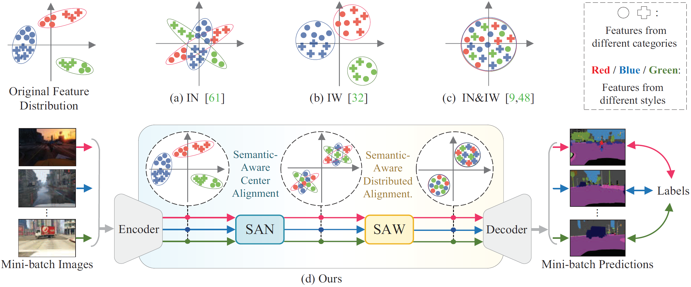
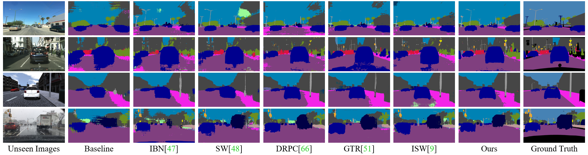

# Semantic-Aware Domain Generalized Segmentation
This is the code related to "Semantic-Aware Domain Generalized Segmentation" (CVPR 2022)
<p align='center'>
  
</p>

## 1. Paper
[Semantic-Aware Domain Generalized Segmentation](https://arxiv.org/abs/2204.00822)  
**IEEE/CVF Computer Vision and Pattern Recognition (CVPR 2022)**

If you find it helpful to your research, please cite as follows:

```
@inproceedings{peng2022semantic,
  title={Semantic-Aware Domain Generalized Segmentation},
  author={Peng, Duo and Lei, Yinjie and Hayat, Munawar and Guo, Yulan and Li, Wen},
  booktitle={Proceedings of the IEEE/CVF Conference on Computer Vision and Pattern Recognition (CVPR)},
  year={2022},
  publisher={IEEE}
}
```

## 2. Preparation
* PyTorch 1.7.1
* CUDA 11.1
* Python 3.7.9
* Torchvision 0.8.2
* Download [**the model**](http://vllab.ucmerced.edu/ytsai/CVPR18/DeepLab_resnet_pretrained_init-f81d91e8.pth) pretrained on ImageNet. Put it into each file named as  (pretianed_model).


## 3. Datasets
- Download [**GTA5 datasets**](https://download.visinf.tu-darmstadt.de/data/from_games/).
- Download [**SYNTHIA**](http://synthia-dataset.net/download/808/). 
- Download [**Cityscapes**](https://www.cityscapes-dataset.com/). 
- Download [**BDDS**](https://doc.bdd100k.com/download.html).
- Download [**Mapillary**](https://www.mapillary.com/datasets).

## 4. Usage
You can directly training the network within the following python file by using IDE such as Pycharm.
```
tools\train.py
```
We present the demo on GTAV to Cityscapes, other Settings can be implemented by converting the following args. (Except for the GTAV training set we use 640×640 resolution, all Settings are consistent with _RobustNet_, including dataloader, dataset partitioning etc. For more information, please refer to [**RobustNet**](https://github.com/shachoi/RobustNet)).


```
arg_parser.add_argument('--data_root_path', type=str, default='XXX')  # Training data path

arg_parser.add_argument('--list_path', type=str, default='XXX')  # Training data list path

arg_parser.add_argument('--dataset', type=str, default='XXX')  # Training dataset

arg_parser.add_argument('--val_dataset', type=str, default='XXX')  # Validation/Testing dataset
```
We present the demo on ResNet50. You can change the backbone by converting the following args.
```
arg_parser.add_argument('--backbone', type=str, default='XXX')  # Network Backbone
```

## 5. Results
<p align='center'>
  
</p>

### update status
The code (V1) is uploaded. (2022-06-19)
